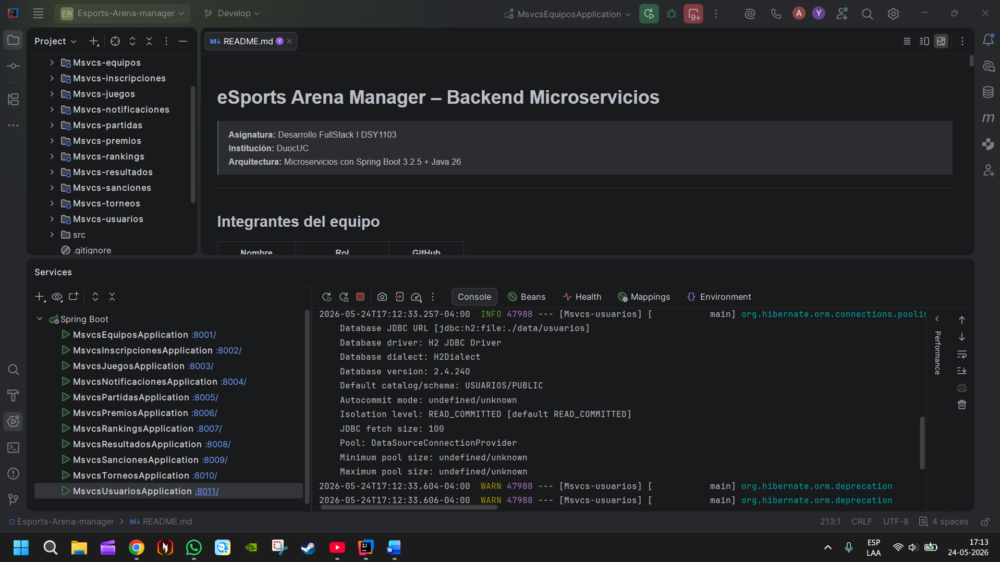

# eSports Arena Manager – Backend Microservicios

> **Asignatura:** Desarrollo FullStack I DSY1103  
> **Institución:** DuocUC  
> **Arquitectura:** Microservicios con Spring Boot 3.2.5 + Java 26

---

## Integrantes del equipo

| Nombre            | Rol                | GitHub        |
|-------------------|--------------------|---------------|
| _Alan Cubillos_   | Backend Dev/Tester | @Alan7273     |
| _Jorge González_  | Backend Dev/Tester | @thyoryi-5    |
| _Martin Espinoza_ | Presentador/Tester | @martindeidad |

---

## Mapa de microservicios y puertos

| Microservicio          | Puerto | Base de datos H2        |
|------------------------|--------|-------------------------|
| `Msvcs-Equipos`        | 8080   | `./data/Equipos`        |
| `Msvcs-Incripciones`   | 8081   | `./data/Incscripciones` |
| `Msvcs-Juegos`         | 8082   | `./data/Juegos`         |
| `Msvcs-Notificaciones` | 8083   | `./data/Notifiaciones`  |
| `Msvcs-Partidas`       | 8084   | `./data/Partidas`       |
| `Msvcs-Premios`        | 8085   | `./data/Premios`        |
| `Msvcs-Rankings`       | 8086   | `./data/Rankings`       |
| `Msvcs-Resultados`     | 8087   | `./data/Resultados`     |
| `Msvcs-Sanciones`      | 8088   | `./data/Sanciones`      |
| `Msvcs-Torneos`        | 8089   | `./data/Torneos`        |
| `Msvcs-Usuarios`       | 8090   | `./data/Usuarios`       |

---

# Diagrama de clases del codigo y su conexiones

---

## Flujo integrador principal

#### 1. Administrador crea juego.
#### 2. Administrador crea torneo.
#### 3. Jugadores crean equipos.
#### 4. Inscripciones-service valida inscripciones.
#### 5. Partidas-service genera partidas.
#### 6. Resultados-service registra resultados.
#### 7. Rankings-service actualiza posiciones.
#### 8. Premios-service asigna premios.
#### 9. Notificaciones-service informa eventos.

----
# Logs Implementados
#### Uso de SLF4J
#### Logs utilizados:
#### creación de entidades
#### actualización
#### errores
#### validaciones fallidas
#### llamadas REST

# Ejemplo:
### log.info(“Usuario creado correctamente”);

----

## Endpoints principales por microservicio 

### Msvcs-usuarios (8090)
| Método | Ruta                    | Descripción           |
|--------|-------------------------|-----------------------|
| POST   | `/api/v1/usuarios`      | Crear usuario         |
| GET    | `/api/v1/usuarios`      | Listar usuarios       |
| GET    | `/api/v1/usuarios/{id}` | buscar usuario por ID |
| PUT    | `/api/v1/usuarios/{id}` | Actualizar usuario    |
| Delete | `/api/v1/usuarios/{id}` | desactivar usuario    |

### Msvcs-equipos (8080)
| Método | Ruta                                              | Descripción                 |
|--------|---------------------------------------------------|-----------------------------|
| POST   | `/api/v1/equipos`                                 | Crear equipo                |
| GET    | `/api/v1/equipos`                                 | Listar equipos              |
| GET    | `/api/v1/equipos/{id}`                            | Buscar equipo por id        |
| POST   | `/api/v1/equipos/{id}/miembros`                      | Agregar miembro del equipo  |
| DEL    | `/api/v1/equipos/{equipoId}/miembros/{usuarioId}`    | Eliminar miembro del equipo |
| PUT    | `/api/v1/equipos/capitan/{id}?capitanId={capitanId}` | Cambiar capitán             |
| DEL    | `/api/v1/equipos/desactivar/{id}`                    | Desactivar equipo           |

### Msvcs-juegos (8082)
| Método | Ruta                             | Descripción         |
|--------|----------------------------------|---------------------|
| POST   | `/api/v1/juegos`                 | Crear juego         |
| GET    | `/api/v1/juegos`                 | Listar juegos       |
| GET    | `/api/v1/juegos/{id}`            | Buscar juego por ID |
| PUT    | `/api/v1/juegos/{id}`            | Actualizar juego    |
| DEL      | `/api/v1/juegos/desactivar/{id}` | Desactivar juego    |

### Msvcs-torneos (8089)

| Método | Ruta                         | Descripción          |
|--------|------------------------------|----------------------|
| POST   | `/api/v1/torneos`            | Crear torneo         |
| GET    | `/api/v1/torneos`               | Listar torneos       |
| GET    | `/api/v1/torneos/{id}`          | Buscar torneo por ID |
| PUT    | `/api/v1/torneos/{id}`          | Actualizar torneo    |
| DEL    | `/api/v1/torneos/cerrar/{id}`   | Cerrar torneo        |
| DEL    | `/api/v1/torneos/cancelar/{id}` | Cancelar torneo      |

### Msvcs-inscripciones (8081)

| Método | Ruta                                                | Descripción               |
|--------|-----------------------------------------------------|---------------------------|
| POST   | `/api/v1/inscripciones`                             | Crear inscripción         |
| GET    | `/api/v1/inscripciones`                             | Listar inscripciones      |
| GET    | `/api/v1/inscripciones/{id}`                        | Buscar inscripción por ID |
| PUT    | `/api/v1/inscripciones/estado/{id}?estado={estado}` | Actualizar estado         |
| DEL    | `/api/v1/inscripciones/cancelar/{id}`               | Cancelar inscripción      |

### Msvcs-partidas (8084)

| Método | Ruta                                              | Descripción           |
|--------|---------------------------------------------------|-----------------------|
| POST   | `/api/v1/partidas`                                | Crear partida         |
| GET    | `/api/v1/partidas`                                | Listar partidas       |
| GET    | `/api/v1/partidas/{id}`                           | Buscar partida por ID |
| PUT    | `/api/v1/partidas/horario/{id}?fechaHora={fecha}` | Actualizar horario    |
| DEL    | `/api/v1/partidas/cancelar/{id}`                  | Cancelar partida      |

### Msvcs-resultados (8086)

| Método | Ruta                              | Descripción             |
|--------|-----------------------------------|-------------------------|
| POST   | `/api/v1/resultados`              | Registrar resultado     |
| GET    | `/api/v1/resultados`              | Listar resultados       |
| GET    | `/api/v1/resultados/{id}`         | Buscar resultado por ID |
| PUT    | `/api/v1/resultados/{id}`         | Actualizar resultado    |
| PUT    | `/api/v1/resultados/validar/{id}` | Validar resultado       |
| DEL    | `/api/v1/resultados/anular/{id}`  | Anular resultado        |

### Msvcs-rankings (8086)

| Método | Ruta                                     | Descripción                     |
|--------|------------------------------------------|---------------------------------|
| GET    | `/api/v1/rankings/{torneoId}`            | Obtener ranking de un torneo    |
| GET    | `/api/v1/rankings/participante/{id}`     | Buscar ranking por participante |
| PUT    | `/api/v1/rankings/recalcular/{torneoId}` | Recalcular ranking              |
| DEL    | `/api/v1/rankings/reiniciar/{torneoId}`  | Reiniciar ranking               |

### Msvcs-premios (8085)

| Método | Ruta                                                           | Descripción          |
|--------|----------------------------------------------------------------|----------------------|
| POST | `/api/v1/premios`                                              | Crear premio         |
| GET | `/api/v1/premios`                                              | Listar premios       |
| GET | `/api/v1/premios/{id}`                                         | Buscar premio por ID |
| PUT | `/api/v1/premios/{id}`                                         | Actualizar premio    |
| PUT | `/api/v1/premios/asignar/{id}?participanteId={participanteId}` | Asignar premio       |

### Msvcs-sanciones (8088)

| Método | Ruta                                    | Descripción                                |
|--------|-----------------------------------------|--------------------------------------------|
| POST | `/api/v1/sanciones`                     | Crear sanción                              |
| GET | `/api/v1/sanciones`                     | Listar sanciones                           |
| GET | `/api/v1/sanciones/{id}`                | Buscar sanción por ID                      |
| PUT | `/api/v1/sanciones/cerrar/{id}`         | Cerrar sanción                             |
| GET | `/api/v1/sanciones/validar/{usuarioId}` | Validar si un usuario tiene sanción activa |

### Msvcs-notificaciones (8083)

| Método | Ruta                                  | Descripción                         |
|--------|---------------------------------------|-------------------------------------|
| POST   | `/api/v1/notificaciones`              | Crear notificación                  |
| GET    | `/api/v1/notificaciones/usuario/{id}` | Listar notificaciones de un usuario |
| GET    | `/api/v1/notificaciones/{id}`         | Buscar notificación por ID          |
| PUT    | `/api/v1/notificaciones/leida/{id}`   | Marcar notificación como leída      |
---

---
# Evidencia que el codigo funciona

## Evidencias requeridas
- [ ] Diagrama de ecosistema de microservicios
- [x] `README.md` con descripción del proyecto, puertos y endpoints
- [ ] Colección Postman exportada
- [x] Repositorio GitHub organizado por microservicios